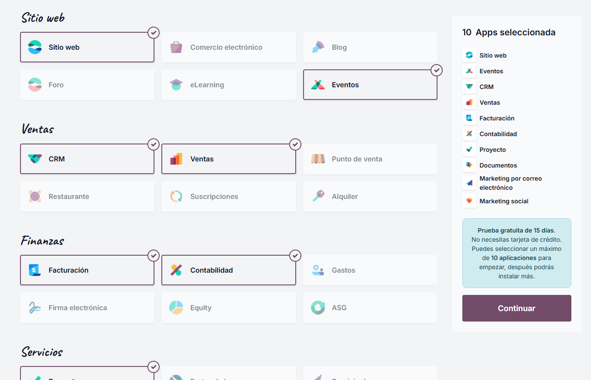

# 03 — Instalación y prueba (15 días) / Alta e instalación de apps

## Requisitos previos
- Navegador actualizado.
- Cuenta de correo para alta.

### Pasos
1. **Crear base de datos de prueba (15 días)**

Para crear nuestra base de datos, en este proyecto vamos a elegir la opción estándar(La del medio). Para hacerlo elegiremos la opción de prueba gratuita, la cual nos dará acceso a la plataforma durante 15 días.

2. **Seleccionar apps iniciales**

Después de entrar a la prueba gratuita, nos pedirá elegir las aplicaciones que querremos utilizar. La prueba gratuita nos da acceso a un máximo de 10 aplicaciones diferentes, algunas de las que vamos a usar para este proyecto son la de Proyecto y la de Documentos.

Una vez seleccionadas las aplicaciones, nos pedira agregar nuestros datos, como pueden ser el correo y el nombre de la empresa.

3. **Instalar/Desinstalar apps**

Una vez terminado el proceso de registro, se nos abrirá nuestra pagina de inicio, simplemente saldremos de la aplicacion en la esquina superior izquierda y llegaremos a nuestro panel de aplicaciones. Tendremos un mensaje en rojo diciendo que tenemos que activar la cuenta, por lo que le pulsaremos y nos iremos a gmail para terminar el proceso.

Para administrar las aplicaciones, en el panel veremos una aplicación llamada "Aplicaciones". Desde ella podremos buscar aplicaciones, instalar aplicaciones nuevas(mientras tengas menos de 10) y desinstalar las que ya tenemos instaladas. Un punto importante a tener en cuenta sobre la desinstalación es que perderemos todos los datos por lo que si queremos guardar esos datos es importante hacer algún tipo de copia de seguridad antes.

