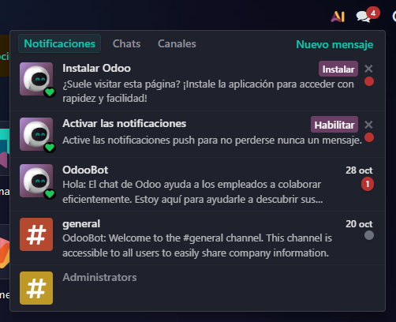
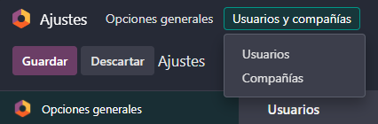
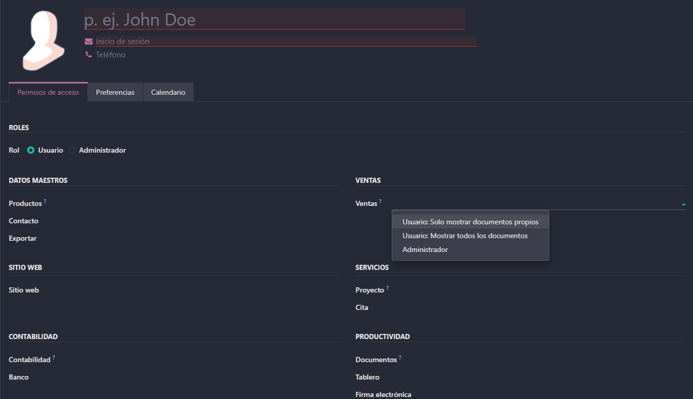
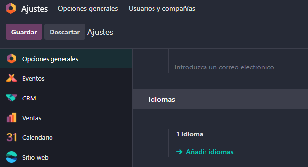
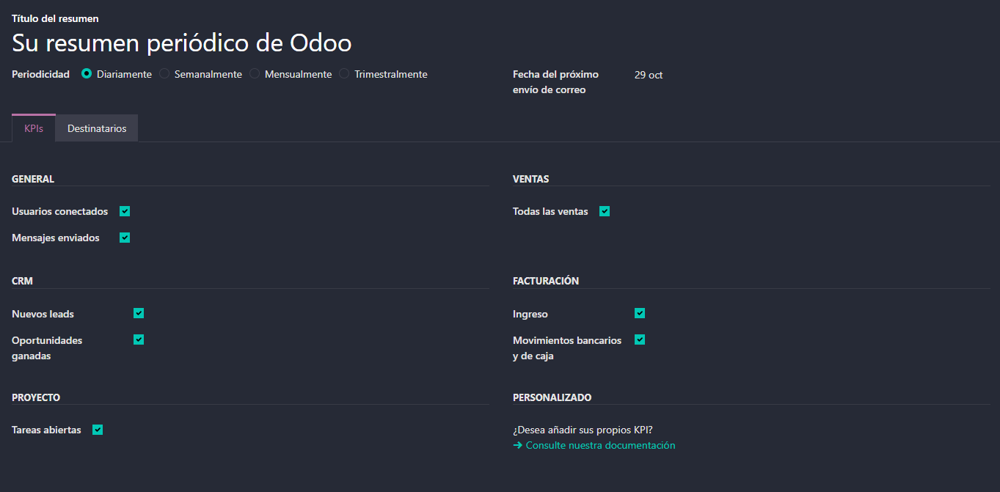

# 04 — Ajustes generales

[Notificaciones](#notificaciones)
[Perfil](#perfil)
[Usuarios y compañias](#usuarios-y-compañías)
[Idiomas y diseño de documentos (plantillas de factura)](#idiomas-y-diseño-de-documentos-plantillas-de-factura)
[Emails de resumen](#emails-de-resumen)

### Notificaciones

Activar las notificaciones es tan sencillo como ir al signo de los globos de texto que se encuentran en la esquina superior derecha, ahí tendras una notificacion que te dejara habilitarlas. 

### Perfil

En el perfil encontramos una gran variedad de campos que podemos ver y modificar. Para entrar en el daremos click en el boton más pegado a la esquina superior derecha, y despues nos meteremos en la seccion de preferencias.

Podremos modificar cosas como el tema(modo claro o modo oscuro), cambiar como queremos que se guarde nuestra firma por correo electronico, si queremos que las notificaciones sean por correo o Odoo(Odoo recomendado) o activar el 2FA en la seccion de Seguridad. Tambien podremos ver nuestros datos personales introducidos al registrarnos, estos tambien podremos modificarlos en caso de necesitarlo.

### Usuarios y compañías.

En los ajustes generales podemos crear multiples usuarios y compañias(teniendo diferentes bases de datos), pudiendo asignarles los modulos correspondientes. Tambien podemos ajustar los datos de nuestra propia empresa como puede ser el logo, la direccion o el CIF. 

Ademas, a los usuarios que creemos podemos elegir a que modulos puede tener acceso y que permisos tiene dentro de esos modulos, aunque hay que tener en cuenta que en la version de Enterprise se paga por usuario.

### Idiomas y diseño de documentos (plantillas de factura).

El idioma lo podemos cambiar tanto desde la ventada del perfil, como desde los opciones generales. 

Justo debajo de los idiomas tienes las opciones de Compañia. En ellas se encuentra "Diseño de documento", el cual nos permite modificar el diseño de nuestras facturas, pudiendo cambiar el tipo de factura, los colores o el pie de pagina. 

### Emails de resumen.

Esta opcion nos permite recibir periodicamente lo que ha ocurrido dentro de nuestra aplicacion, mostrandonos por ejemplo el numero de leaks que hemos recibido o el numero de correos electronicos recibidos. Podemos incluso decidir que dicho correo lo reciba otra persona.

