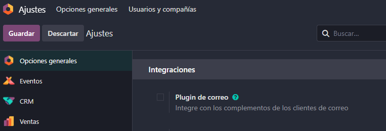
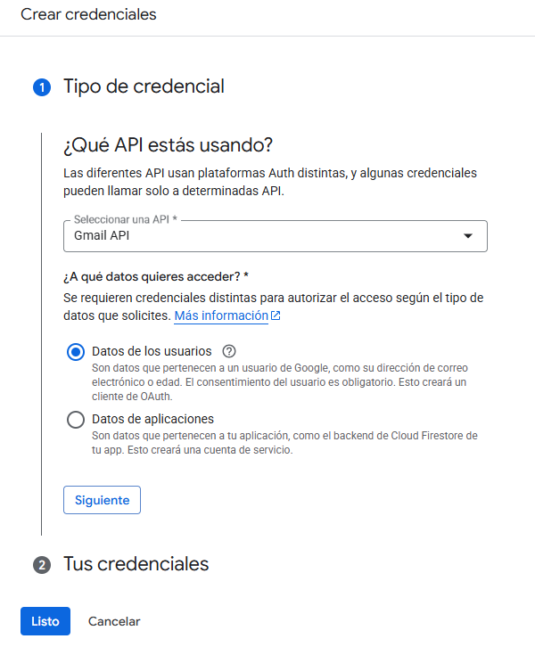
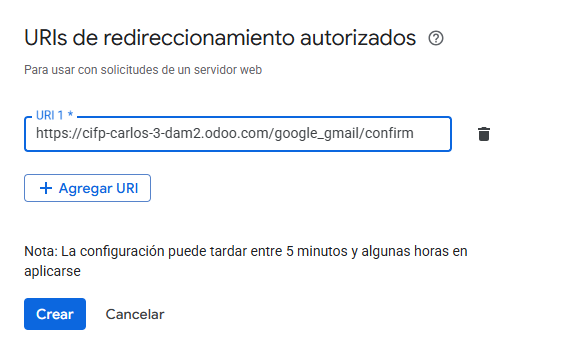
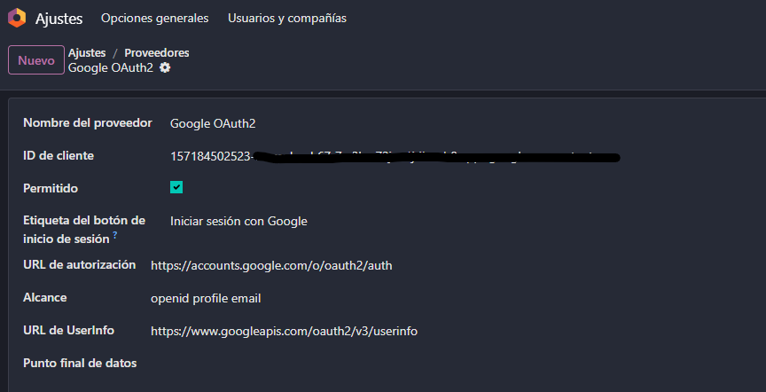
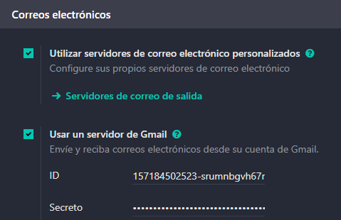
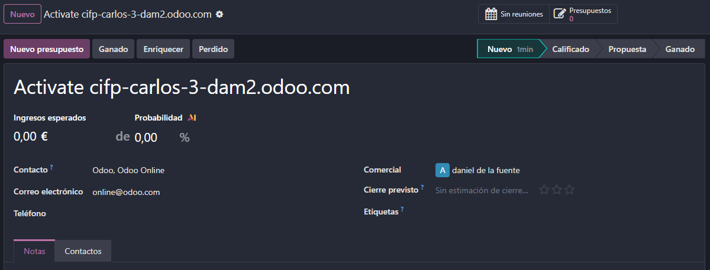

# 05 — Integración con Gmail (OAuth GCP + Add-on)

## Requisitos
- Cuenta Google Cloud (GCP).

## Pasos resumidos
1. **Activar plugin de correo** en Odoo e instalar *Odoo Inbox Add-on* en Gmail.

Lo primero que vamos a hacer es ir a opciones generales y en la parte de integraciones activaremos "Plugin de correo". Una vez tengamos esto habilitado nos iremos a Gmail y pulsaremos en el "+" que se encuentra en el centro de la parte derecha, y ahí buscaremos la aplicación "Odoo Inbox Addin" y la instalaremos, de esta forma podremos vincular todo nuestro correo electrónico con Odoo. Ahora nos aparecerá a la derecha la aplicación, si nos vamos a algún correo y hacemos login en la aplicación, la propia aplicación nos mostrara toda la información de la empresa del correo que tenemos abierto

2. En **Google Cloud Console**: habilitar *Gmail API*, crear **OAuth Client (Web)**, configurar **redirect URI** de Odoo.

Ahora nos iremos de nuevo a la parte de integraciones, activaremos "Autentication OAuth" y guardaremos. Ahora buscaremos Google Console en el navegador y nos meteremos en la primera opción y ahí crearemos un nuevo proyecto. Una vez creado y dentro del proyecto buscaremos la API de Gmail que es la que queremos habilitar(puede aparecer habilitada, pero lo normal sería que no).

Ahora nos le daremos a crear credenciales en la derecha. En el tipo de credencial marcaremos "Datos de los usuarios" y en la información de la aplicación elegiremos el nombre de la aplicación y pondremos nuestro email. 

En permisos le daremos a "Agregar o quitar permisos" y en el buscador pondremos "Google API", por ultimo marcaremos las siguientes opciones:

Guardaremos los permisos elegidos y continuaremos. En tipo de aplicación elegiremos "Aplicación Web" y nos iremos a añadir la URL de redireccionamiento, la cual es la siguiente: 
https://tuNombre.odoo.com/google_gmail/confirm

Con esto ya habremos terminado de modificar la API.

3. Copiar **Client ID/Secret** a Odoo (Gmail server settings) y **Guardar**.

Nos meteremos en la parte de credenciales y seleccionaremos el "ID de cliente para Aplicación web" que acabamos de crear. En esta ventana nos aparecerá tanto el ID del cliente como el Secreto del cliente, los cuales copiaremos y nos lo llevaremos a los ajustes de integraciones, donde añadiremos un proveedor con los datos del cliente que acabamos de crear, por ultimo guardaremos los datos.

Lo ultimo que tenemos que configurar es en la parte de correo electrónico, donde marcaremos "Utilizar servidores de correo electrónico personalizados" y nos aparecerá una nueva opción que nos pedirá también los datos del cliente. Con esto, ya podremos controlar nuestro correo completamente desde Odoo.

4. Probar desde Gmail.

Para comprobar que todo esto ha funcionado bien, podemos irnos a cualquier correo que tengamos en Gmail, meternos en el Add-on de Odoo y guardar como contacto a la empresa. Una vez que este guardado, nos permitirá crear oportunidades o tareas con esta empresa.

