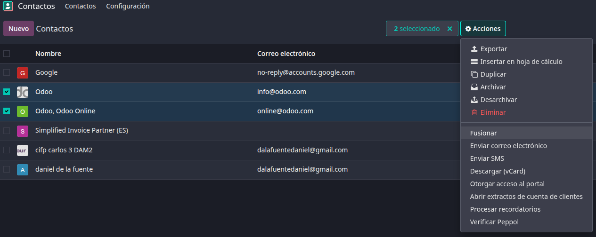
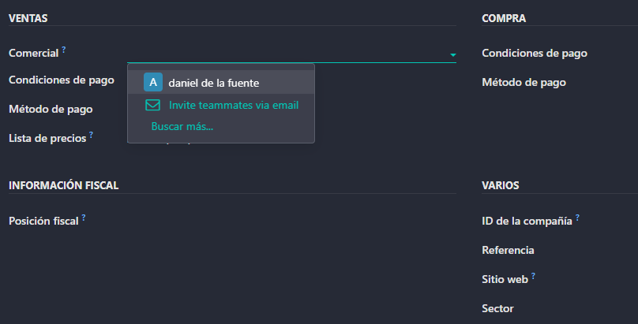
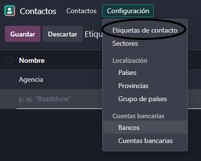
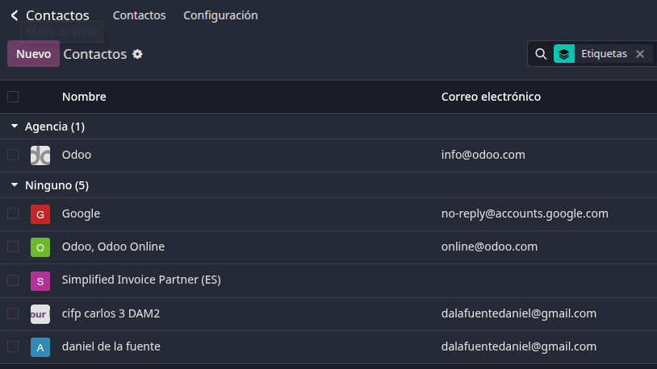
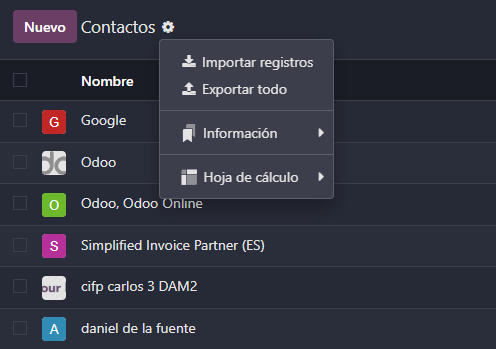
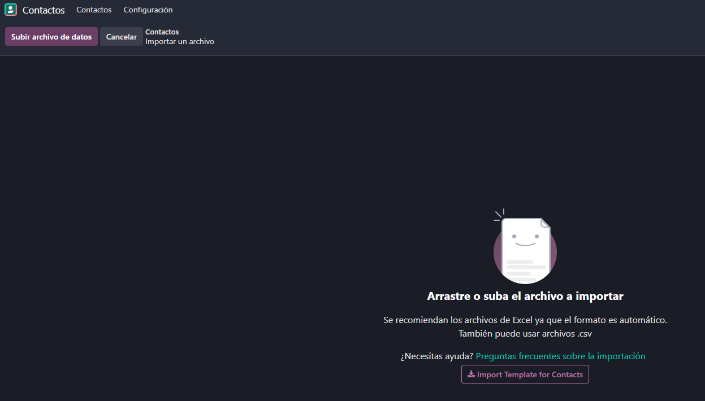
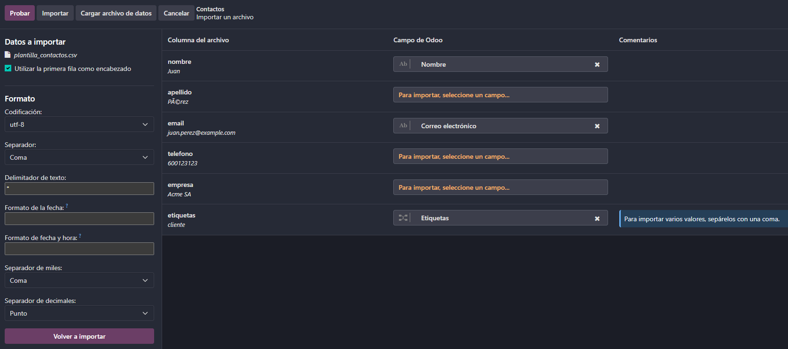

# 06 — Contactos

1. [Contactos](#contactos)
2. [Etiquetas para segmentar](#etiquetas-para-segmentar)
3. [Importación CSV](#importación-csv)

### Contactos

El modulo de contactos es un modulo muy útil. En este modulo por defecto nos aparecerá el contacto nuestro y también nos aparecerán los contactos que habíamos agregado desde el modulo de Gmail. Desde este modulo podremos hacer cosas como por ejemplo pasar los contactos al modulo de de CRM y si se convirtiese en un cliente podríamos mandarle un presupuesto o una factura.

Los contactos pueden distinguirse entre individuos y compañías. Si nos vamos a una compañía podemos ver que dentro de la empresa nos aparecerá el individuo.
Estos dos contactos los podremos fusionar para tener en un solo contacto o podriamos meter los contactos dentro de una base de datos.

A cada contacto podremos configurarle datos como los comerciales que serán los responsables o las condiciones de pago.

### Etiquetas para segmentar.

Una buena practica es crear etiquetas asociadas a los contactos. Podremos crear etiquetas tanto desde dentro de los contactos como directamente desde "Configuración/Etiquetas de contacto".

Una buena forma de encontrar un contacto en concreto es filtrando por un montón de variables entre ellas las etiquetas, de forma que nos mostraran todas las etiquetas que tenemos y podremos ver que contactos las tienen.

### Importación CSV.

Para importar contactos pulsaremos en el engranaje de ajustes y le daremos a importar registraos. Allí dentro podremos tanto subir directamente la plantilla de importación, como subir directamente un cliente ya creado. Los contactos tienen que tener sus datos separados por comas para que lo reconozca Odoo.

