# 07 — Calendario y Citas

1. [Calendario](#calendario)
2. [Integración con Google Calendar (API OAuth GCP)](#integración-con-google-calendar-api-oauth-gcp)
3. [Eventos y Odoo Meet](#eventos-y-odoo-meet)
4. [Módulo Citas](#módulo-citas)

### Calendario.

Odoo nos permite tener un calendario en el que apuntar todas nuestras actividades y nuestra agenda. Podemos verlo en formato de días, semanas o meses. También nos da la posibilidad de ver los calendarios de toda la gente de la empresa, lo cual puede venir muy bien para agendar una reunión.

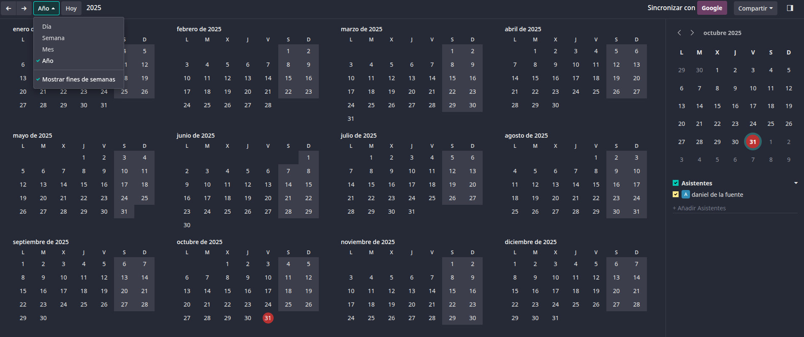

### Integración con Google Calendar (API OAuth GCP).

Este calendario lo podemos conectar junto al calendario de Google. Para ello tendremos que ir a tocar algunas cosas de la API.

Primero entraremos en Google console y crearemos un nuevo proyecto y lo seleccionaremos. Después en el buscador buscaremos Google Calendar API y la habilitaremos.

Una vez habilitada le daremos a crear credenciales y marcaremos las siguientes opciones:

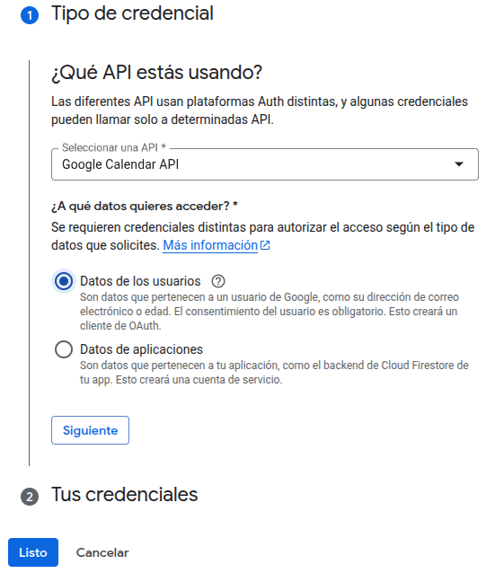
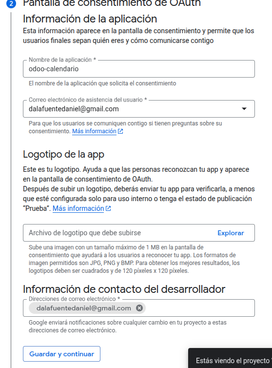
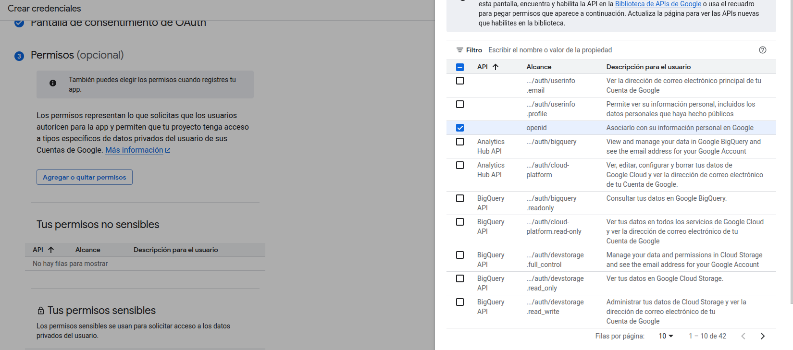
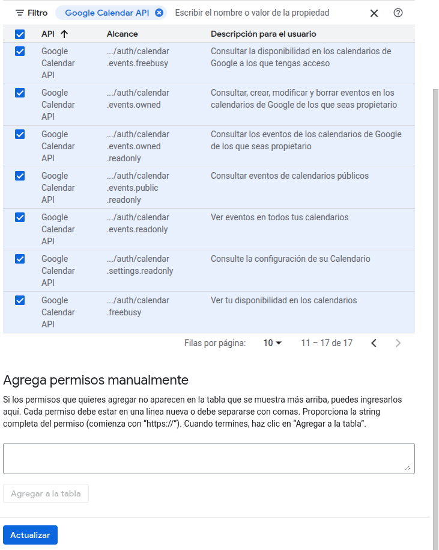

La URL de redireccionamiento será la siguiente:
https://tuNombre.odoo.com/google_account/authentication

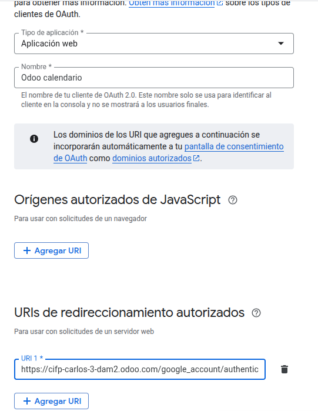

Con esto ya habremos terminado de modificar la API, ahora deberemos meternos en la pestaña de credenciales y buscar el proyecto.

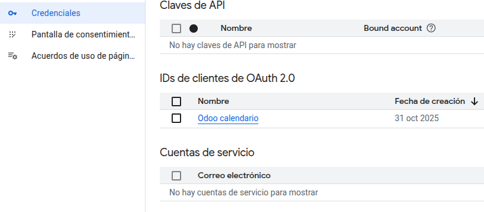

Una vez dentro del proyecto encontraremos el ID del cliente y el secreto del cliente. Estos datos deberemos copiarlos, nos iremos a los ajustes del calendario y encontraremos una zona donde podremos pegar esos dos datos(no olvidar darle a guardar).

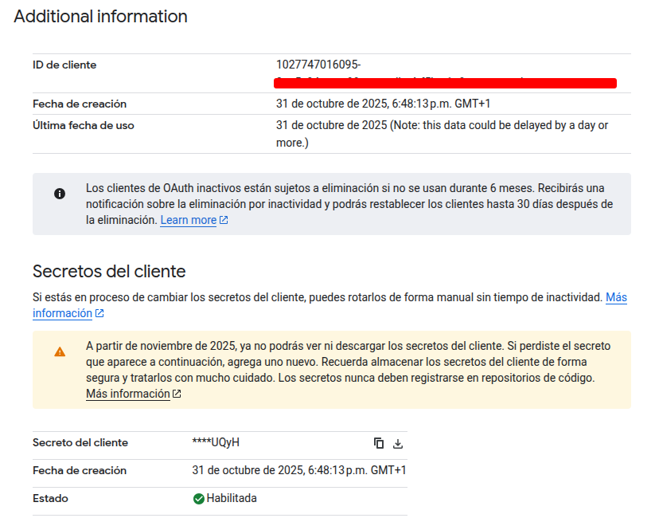
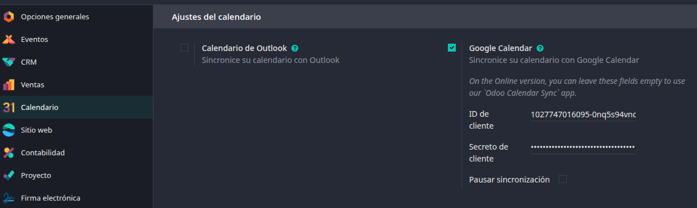

### Eventos y Odoo Meet.

En el calendario podremos crear eventos, los cuales se crean tan fácil como dar clic encima. Podremos ajustar tanto la fecha de inicio como la de fin, además de marcar si queremos que dure todo el día.

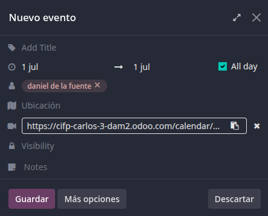

Al evento podemos adjuntarle una URL para una videollamada(zoom, meet, etc), pero Odoo también nos da una opción para crear una reunión a través de su propio servicio.

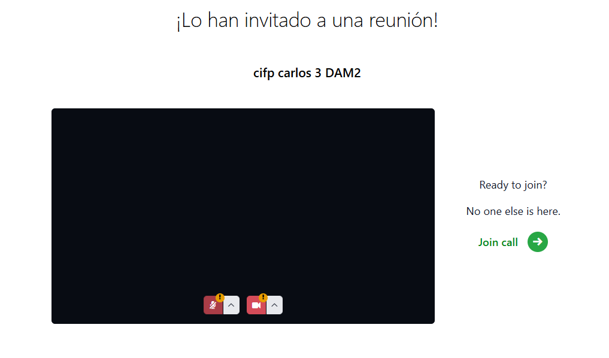

También podremos editar los eventos para darle mas datos y hacerlo mas completo, por ejemplo, podríamos poner etiquetas, mandar correos electrónicos a todos los participantes o añadir notas.

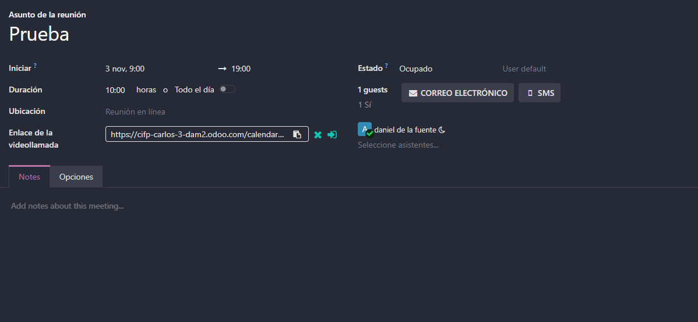

### Módulo Citas.

El modulo de citas es muy interesante si ofrecemos servicios de consultoría, servicios médicos, reservas de equipo, etc, en los que queremos que una persona se apunte a una hora concreta en la que interactuar con el. 

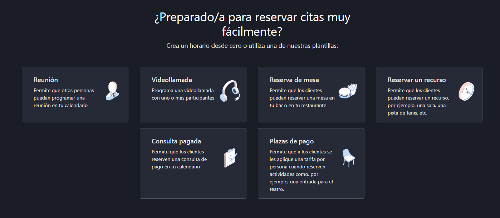

En los ajustes de las citas podremos ajustar cosas como el asunto, cuanto van a durar, el tiempo de disponibilidad o incluso si quieres reservar un usuario o un recurso.

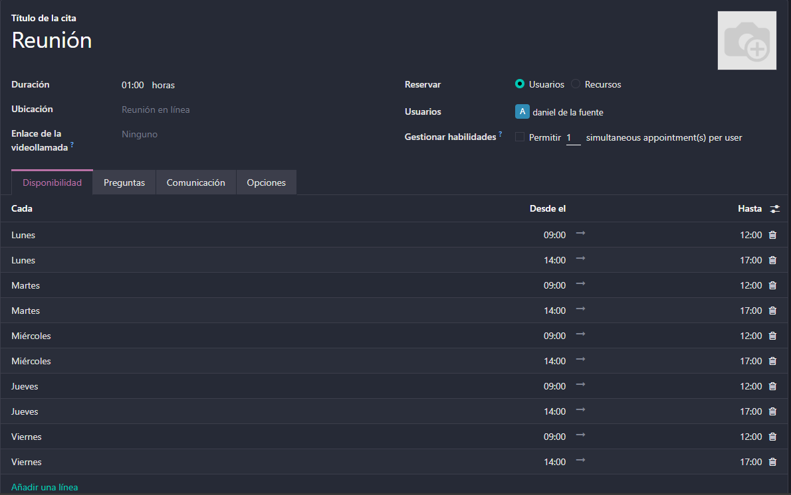

Si le damos a compartir, nos creara un enlace el cual si lo copiamos y lo pegamos en el navegador, nos saldrá una interfaz donde el cliente podrá elegir el día y la fecha de cuando quiere la cita y luego deberá agregar sus datos. 

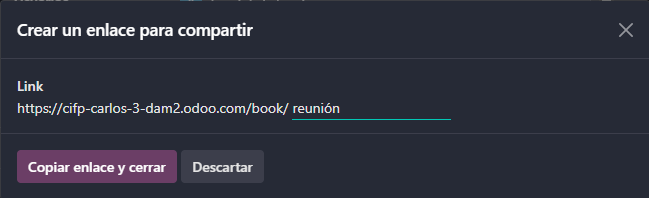
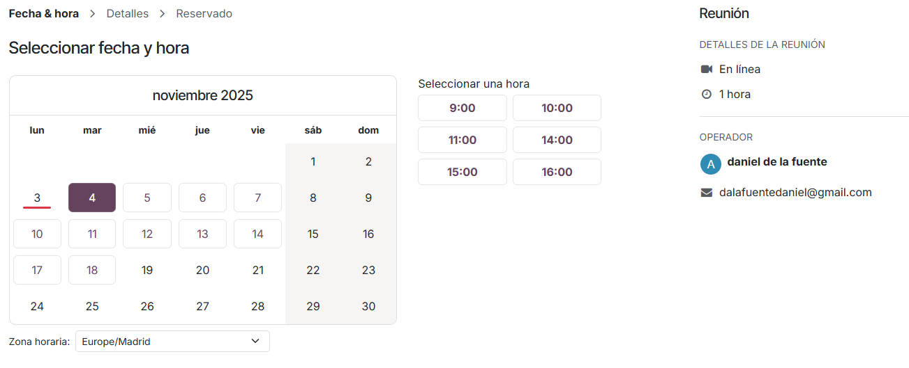
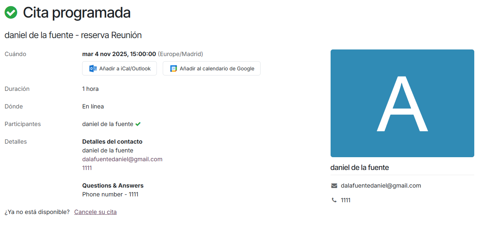

Una vez confirmada la cita, en el informe de confirmación nos saldrá un botón que nos permitirá añadir la cita al calendario de Google. Al hacerlo, si nos vamos de vuelta al calendario de Odoo, nos aparecerá la cita recién creada en el.

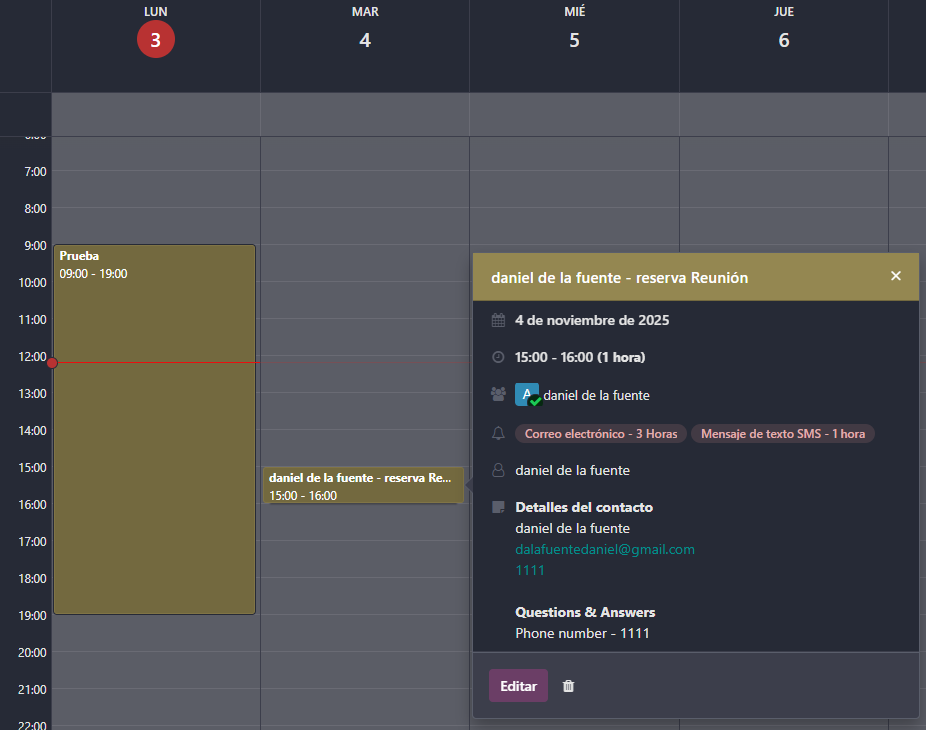
