# 08 — Proyectos (Kanban)

[Proyectos, etapas, tareas, subtareas](#proyectos-etapas-tareas-subtareas)
[Tareas recurrentes, dependencias, hitos](#tareas-recurrentes-dependencias-hitos)
[Vistas: tarjetas, lista, calendario propio](#vistas-tarjetas-lista-calendario-propio)
[Calificación del cliente](#calificación-del-cliente)

### Proyectos, etapas, tareas, subtareas.

El modulo de proyectos es uno de los modulos que debemos instalar cuando empezamos la prueba gratuita. A la hora de crear un proyecto nos preguntara si va a ser facturable o no, lo cual puede ser util ya que podriamos asignarle un cliente que tengamos guardado.

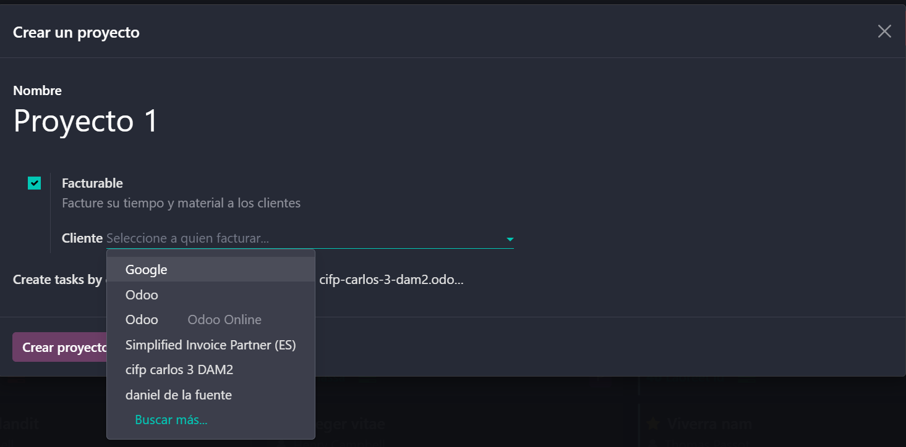

Ya en del proyecto, lo primero que tendremos que hacer es crear una etapa, al lado de la etapa que acabamos de crear podremos darle a "Añadir etapa" para crear una nueva etapa del proyecto, como podria ser la etapa "En progreso" o "Finalizado".

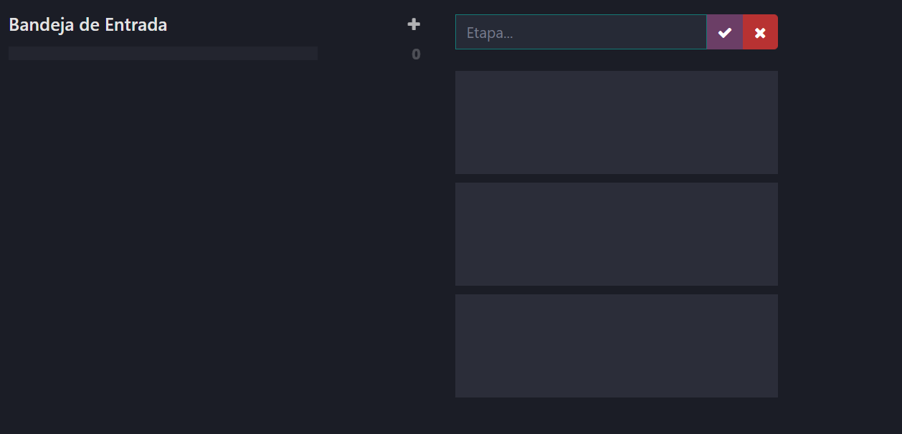

Dentro de una etapa, dandole al "+" podremos crear tareas, las cuales podran ser asignadas a alguno de los usuarios de la base de datos. Podemos entrar en la tarea para configurar datos de ella como su descripcion, el cliente, la prioridad o la fecha limite. Estas tareas podemos ir moviendolas entre etapas simplemente arrastrandolas o desde la propia configuracion de la tarea.

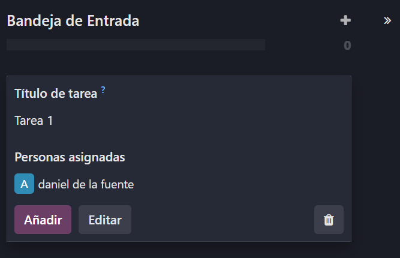
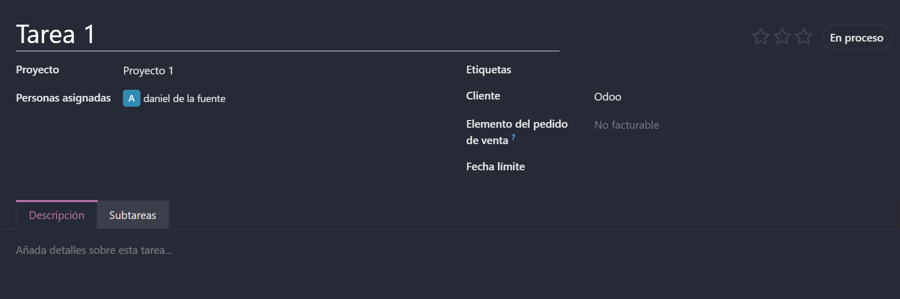
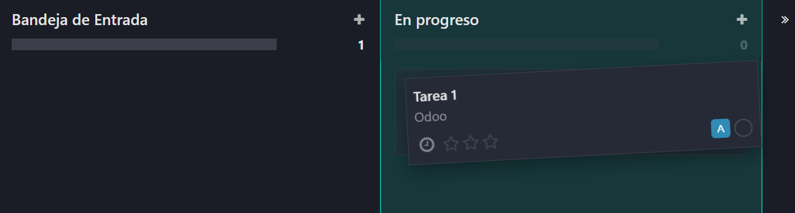

Ademas tambien, dentro de las tareas podremos crear subtareas lo cual nos va a ayudar a gerarquizar las prioridades. Incluso puedes entrar en la configuracion de la subtarea para poner aun mas subtareas.

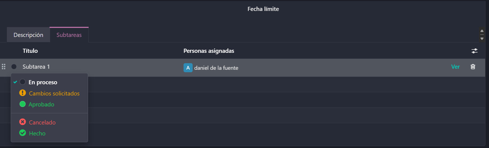

### Tareas recurrentes, dependencias, hitos.

Nos tenemos que ir a los ajustes del proyecto, para ello pondremos el raton sobre el proyecto y pinchamos en los tres puntos que apareceran, acto seguido le daremos a ajustes y ahí activaremos las tareas recurrentes, las dependencias y los hitos.

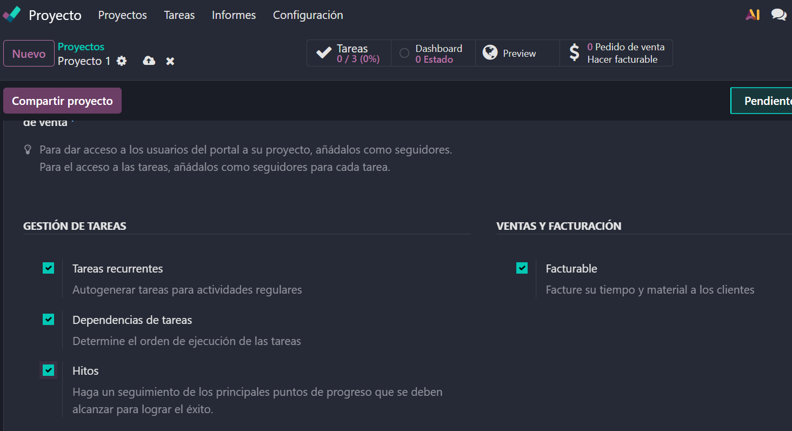

Ahora podremos irnos a alguna tarea de ese proyecto y nos aparecera una opcion con forma de rueda de carga. Si pulsamos en ella podremos decirle cada cuanto se va a estar repitiendo esta tarea y durante cuanto tiempo.

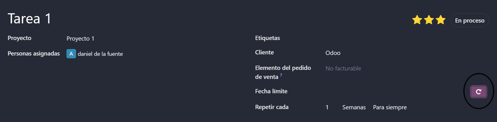

Otra de las opciones de ajustes es la dependencia de tareas. Al activarla, al lado de la opcion de subtareas dentro de una tarea, aparecera un nuevo boton llamado "Bloqueado por". Esto sirve para condicionar una tarea de forma que no pueda hacerla antes de hacer otra que le digamos.

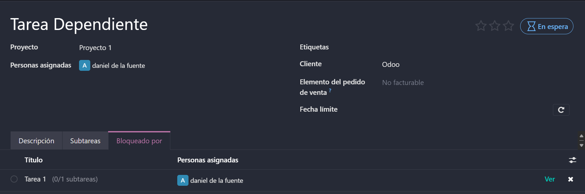

Por ultimo estan los hitos. Los hitos sirven como puntos clave de seguimiento dentro de un proyecto. Son especialmente útiles para estructurar, controlar y comunicar el progreso de tareas importantes.

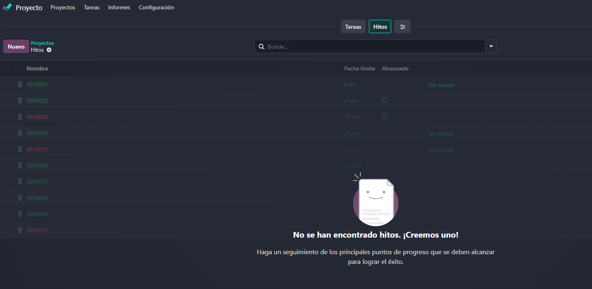

### Vistas: tarjetas, lista, calendario propio.

Los proyectos nos apareceran como tarjetas, lo cual puede sonar familiar si se esta familiarizado con Trello. Sin embargo tembien podemos cambiarlo para que nos aparezca como si fuese una lista, en la cual podriamos ver no solo nuestras tareas sino tambien la del resto de usuarios de la base de datos.

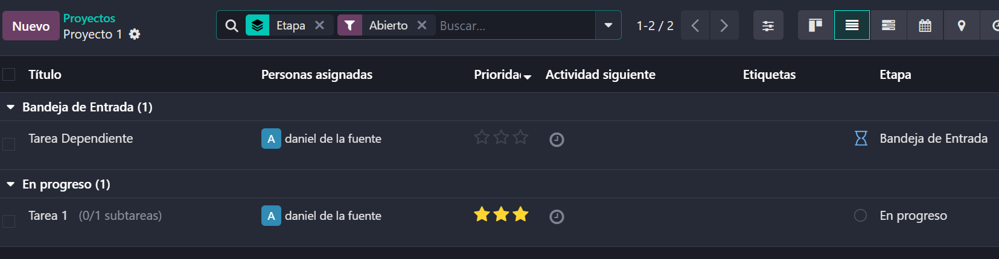

Una de las formas de vista que nos permite usar Odoo es la de calendario, que nos permite ver las tareas recurrentes y las tareas pendientes por hacer. Un punto importante es que este calendario es unico para el proyecto en el que lo vemos, ya que en Odoo no existe un calendario maestro en el que podamos ver todos los modulos que tengamos.

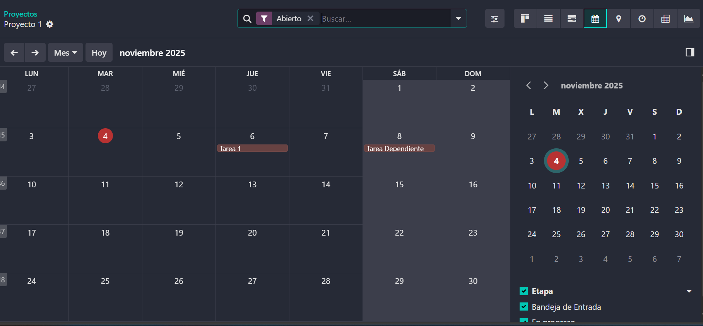

### Calificación del cliente.

La opcion de calificacion del cliente es una opcion muy util en la que podamos recibir el feedback de los clientes, lo cual es una informacion muy importante para saber como lo vamos haciendo.

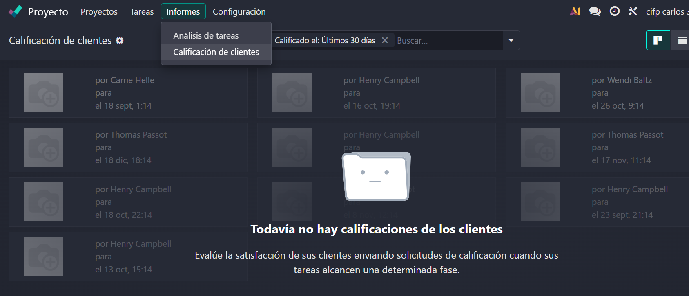
