# 09 — Documentos, Firma e Información (Knowledge)

[Documentos](#documentos)
[Firma electrónica](#firma-electrónica)
[Información (Knowledge)](#información-knowledge)

### Documentos.

El modulo de documentos nos permite tener una empresa libre de papeles, permitiendonos meter todo tipo de documentos como pueden ser docs, PDFs o tablas de Exel.

Nos permite meterle documentacion tanto a todos los proyectos que tenemos creados, como a un modulo o empleado en concreto. Odoo ademas tiene una integracion con sus propias hojas de calculo, lo que mejora el trabajo colaborativo al mostrar que es lo que ha ocurrido y quien ha modificado que cosa, evitando problemas de compatibilidad o duplicado de informacion.

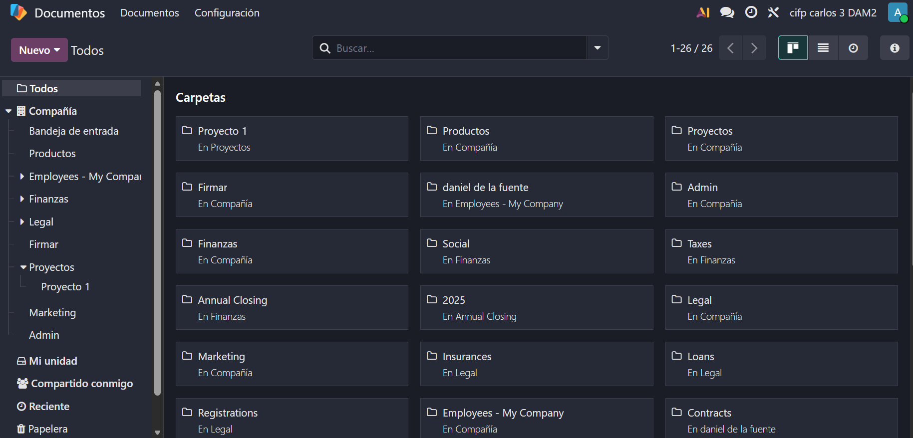
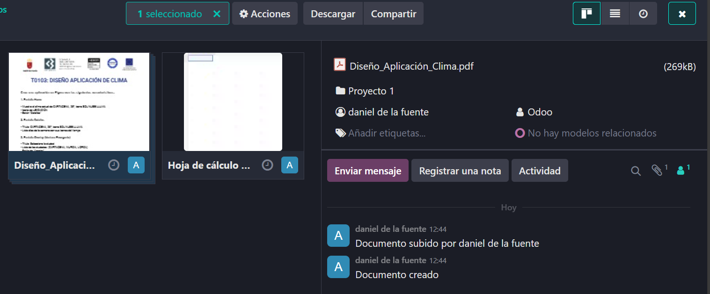
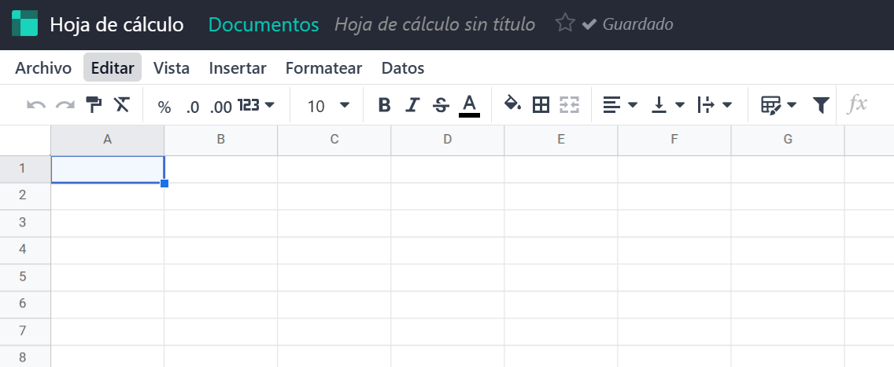

A los PDFs y documentos podemos asignarles etiquetas o usuarios ademas de que tipo de documento es o como vamos a utilizarlo, o incluso programar actividades atraves de dicho documento. Ademas, dentro de la seccion de acciones podemos desde renombrar el archivo hasta dividir o fusionar un PDF.

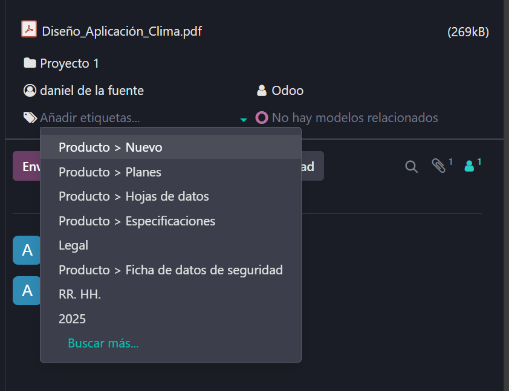
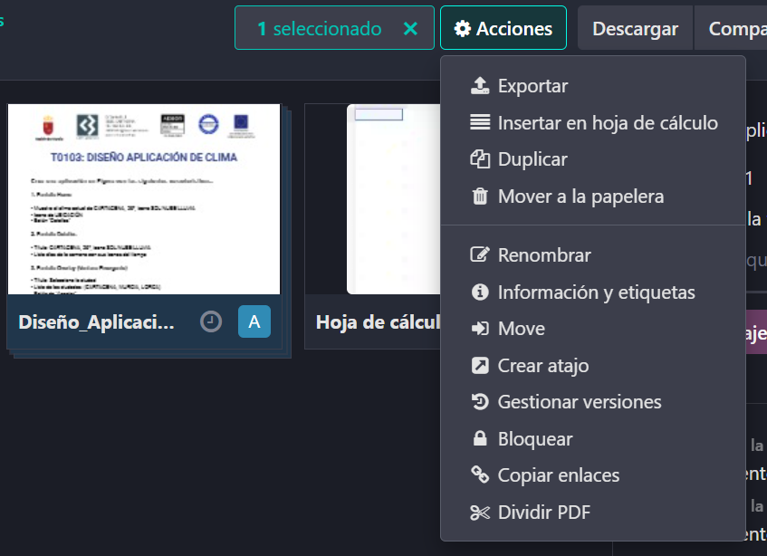
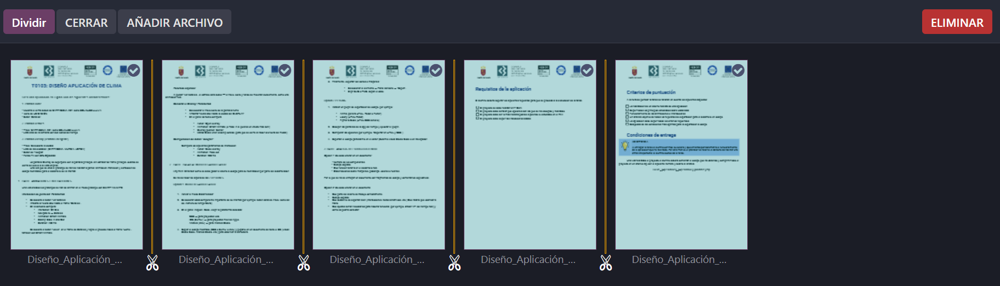

### Firma electrónica.

Este modulo nos deja un ejemplo para poder comprender como funciona. Nos mostrara un ejemplo de un contrato, en el que podremos arrastrar las cajas de donde querriamos que estuviesen los datos a insertar, siendo en este caso la firma, el nombre y la fecha, aunque podriamos meter más datos como textos extra o correos electronicos.

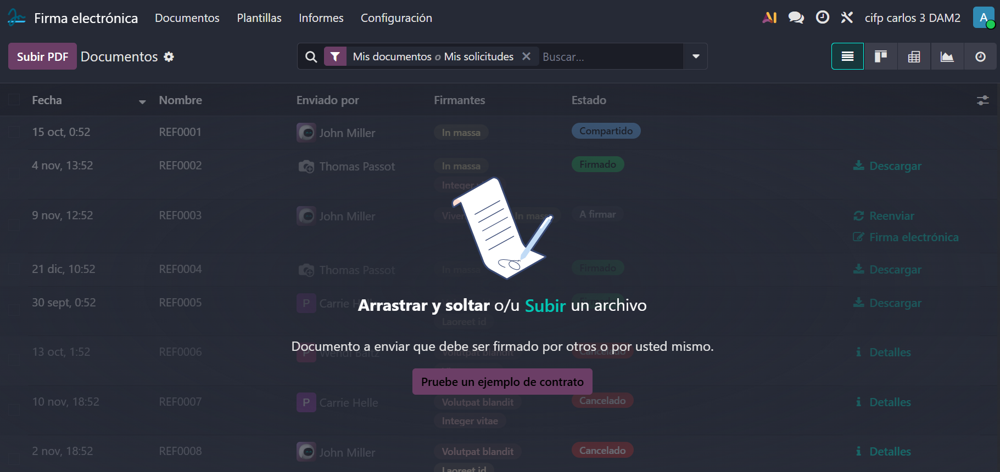
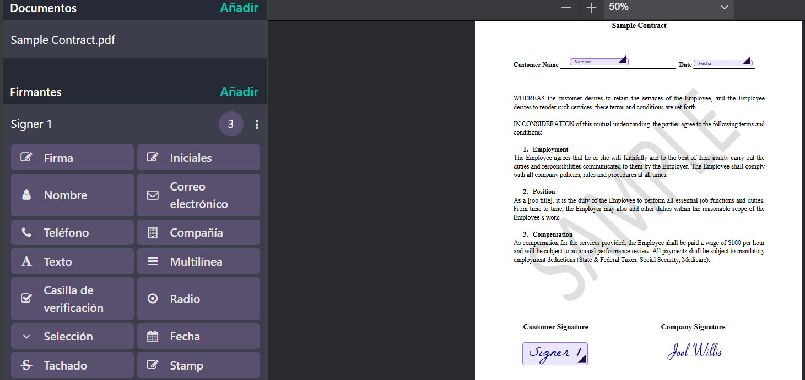

Una vez terminado de arrastrar los elementos podemos enviarlo a algun cliente con datos como hasta cuando es valido o añador certificados en cada pagina.

Tambien podemos darle a "Firmar ahora" y solo tendremos que darle click en los elementos para ir escribiendo sobre ellos. Al pinchar sobre la firma podremos tanto hacer que se escriba automaticamente poniendo nuestro nombre, como dibujarla a mano o cargar una firma ya existente. Una vez validado y enviado podremos descargar el resultado y ahora en el menu principal de la firma electronica nos saldra como firmado el documento.

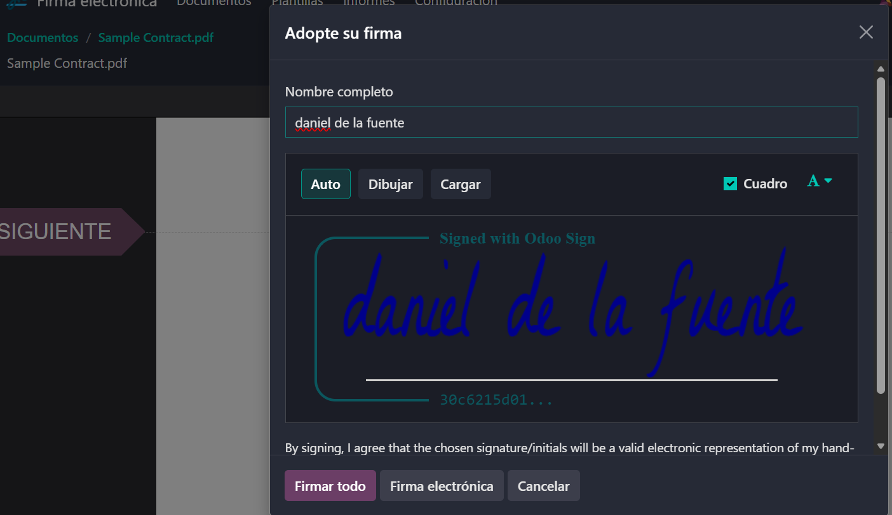

### Información (Knowledge).

Este modulo nos permite aglutinar a nivel externo como interno la informacion de la empresa. Nada mas entrar, se vera una inspiracion en aplicaciones como Notion. Funciona por espacios de trabajo, el cual al crearlo lo primero que deberemos hacer sera nombrarlo. En los tres puntos de la derecha podremos desde añadir iconos hasta insertar una portada que podremos ajustar o cambiarla. Tambien podriamos seguir anidando mas espacios de trabajo dentro de otros espacios. Con la barra del slash(/) podremos ingresar una gran cantidad de elementos como pueden ser titulos o indices.

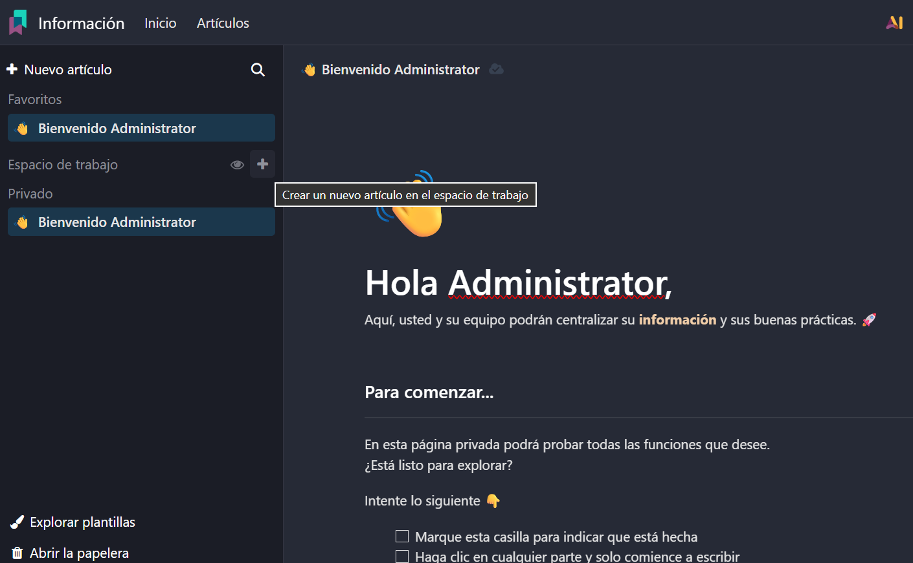
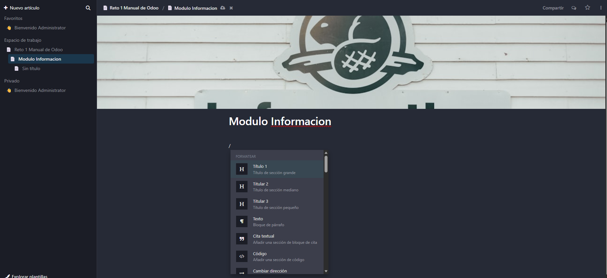

Tambien podremos compartir en la web lo que hayamos creado al permitirnos crear un enlace directo a la informacion que podriamos darselo a quien queramos. Podemos ajustar los permisos de las personas que reciban los enlaces, haciendo que solo puedan leer o tambien puedan editar.

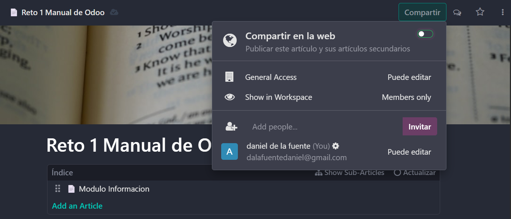
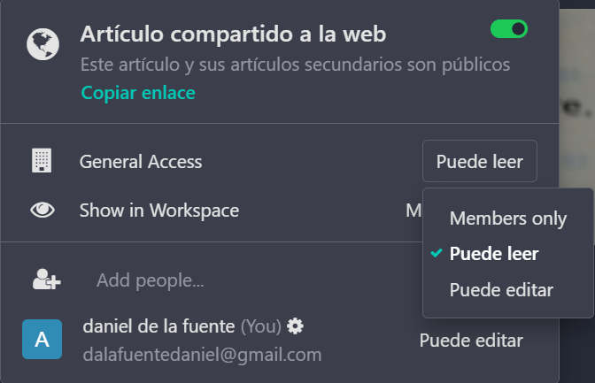

Por ultimo podremos vincular esta wiki en alguna de las tareas de los proyectos que hemos creado.

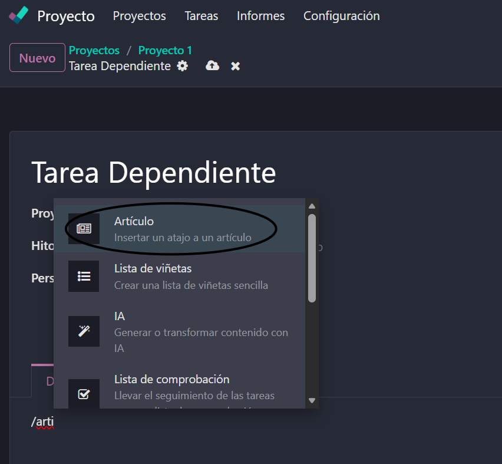
