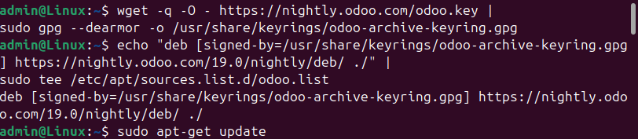
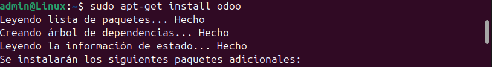

# 06 — Instalación de Odoo

> Elige uno de los métodos y documenta tu elección.

## Paquete oficial (repositorio Odoo)
1. Añade repositorio/clave y luego instala `odoo`:
   ```bash
   wget -q -O - https://nightly.odoo.com/odoo.key | sudo gpg --dearmor -o /usr/share/keyrings/odoo-archive-keyring.gpg
   echo 'deb [signed-by=/usr/share/keyrings/odoo-archive-keyring.gpg] https://nightly.odoo.com/19.0/nightly/deb/ ./' | sudo tee /etc/apt/sources.list.d/odoo.list
   sudo apt-get update && sudo apt-get install odoo
   ```

   
   
